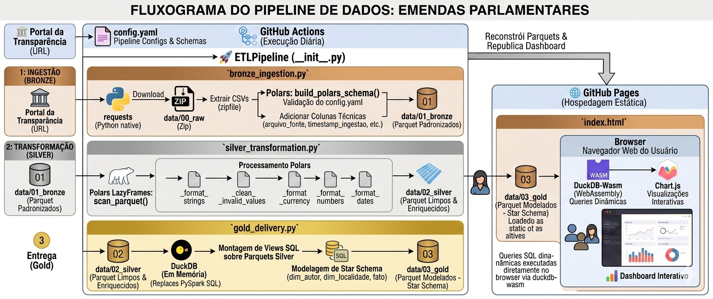

# Emendas Parlamentares

Pipeline ETL de dados públicos de **emendas parlamentares** do [Portal da Transparência](https://portaldatransparencia.gov.br/), processado com **Polars** e entregue via **DuckDB**, com dashboard interativo publicado no **GitHub Pages** e atualizado diariamente via **GitHub Actions**.

[**Live Dashboard:**](https://matheusesilva.github.io/emendas-polars/)

---

## Como usar

Faça um **fork** do repositório — o pipeline roda automaticamente pelo GitHub Actions toda vez que atualizado, e o dashboard é publicado via GitHub Pages.

Para rodar localmente:

```bash
# 1. Instale as dependências
pip install polars duckdb pyyaml requests

# 2. Execute o pipeline
python main.py
```

---

## Pipeline ETL



O pipeline é composto por quatro etapas executadas em sequência:

```
Download (00_raw) → Ingestão (01_bronze) → Transformação (02_silver) → Entrega (03_gold)
```

### 1. Raw — Download
Baixa o arquivo `.zip` diretamente do Portal da Transparência e salva em `data/00_raw/`.

### 2. Bronze — Ingestão
- Extrai os CSVs do `.zip` para uma pasta temporária
- Aplica o schema definido no `config.yaml` via `build_polars_schema()`
- Adiciona colunas de metadata: `arquivo_fonte`, `timestamp_ingestao`, `reference_date`
- Salva cada tabela como `.parquet` em `data/01_bronze/`

**Tabelas ingeridas:**

| Arquivo CSV | Tabela Bronze |
|---|---|
| `EmendasParlamentares.csv` | `EmendasParlamentares.parquet` |
| `EmendasParlamentares_Convenios.csv` | `EmendasParlamentares_Convenios.parquet` |
| `EmendasParlamentares_PorFavorecido.csv` | `EmendasParlamentares_PorFavorecido.parquet` |

### 3. Silver — Transformação
Lê cada Parquet da bronze via `pl.scan_parquet()`, aplica uma cadeia de transformações com Polars LazyFrames e sobrescreve o arquivo em `data/02_silver/`:

| Transformação | Descrição |
|---|---|
| `_format_strings` | Initcap/Sentcap, preposições em minúsculo, siglas de UF e acrônimos entre parênteses |
| `_clean_invalid_values` | Substitui valores inválidos configurados no YAML por `null` |
| `_format_currency` | Remove caracteres não numéricos e converte para `Float64` (`NUM_BRL`) |
| `_format_numbers` | Remove não-dígitos e converte para `Int32` (`NUM_INT`) |
| `_format_dates` | Converte strings para `Date` conforme formato definido no YAML (`DAT_*`) |

### 4. Gold — Entrega
Cria um banco **DuckDB** em memória, monta views sobre os Parquets da silver e exporta o modelo Star Schema para `data/03_gold/`:

| Tabela | Tipo | Descrição |
|---|---|---|
| `dim_autor` | Dimensão | Autores de emendas |
| `dim_localidade` | Dimensão | Municípios, UFs e Regiões |
| `fato_execucao_orcamentaria` | Fato | Valores empenhados e pagos por emenda |

---

## Configuração (`config.yaml`)

O pipeline é integralmente configurável pelo `config.yaml`:

- **`url` / `file_name`**: fonte de download
- **`storage`**: caminhos das camadas (`raw`, `bronze`, `silver`, `gold`, `logs`)
- **`content.<tabela>.schema`**: nome, tipo e formato de cada coluna
- **`content.<tabela>.invalid_values`**: valores a substituir por `null`

**Formatos de coluna suportados:**

| Categoria | Estilo | Efeito |
|---|---|---|
| `STR` | `INITC` | Todas as palavras com inicial maiúscula |
| `STR` | `SENTC` | Apenas a primeira letra da sentença em maiúsculo |
| `STR` | `UPPER` | Tudo em maiúsculo |
| `NUM` | `BRL` | Remove símbolo monetário e converte para `Float64` |
| `NUM` | `INT` | Remove não-dígitos e converte para `Int32` |
| `DAT` | `dd/MM/yyyy` | Converte string para `Date` |

---

## Dashboard Interativo

O dashboard web é hospedado no **GitHub Pages** e oferece:

- Consultas SQL dinâmicas executadas diretamente no browser via **duckdb-wasm** (WebAssembly)
- Visualizações interativas com **Chart.js**

**Fluxo:**
1. O browser carrega os Parquets da camada gold publicados junto com o site
2. duckdb-wasm executa queries SQL diretamente sobre os arquivos
3. Chart.js renderiza os gráficos com os resultados

**Atualização:** o GitHub Actions executa o pipeline diariamente, reconstruindo os Parquets e republicando o dashboard automaticamente.

---

## Estrutura do repositório

```
emendas-polars/
├── config.yaml                        # Configuração do pipeline e schemas
├── main.py                            # Entrypoint — argumentos CLI
├── index.html                         # Dashboard usando Chart.js e DuckDB wasm
├── src/
│   ├── __init__.py                    # ETLPipeline (orquestra as etapas)
│   ├── bronze_ingestion.py            # Download + ingestão para Parquet
│   ├── silver_transformation.py       # Limpeza e formatação com Polars
│   ├── gold_delivery.py               # Star Schema com DuckDB
│   └── utils.py                       # Config, logger JSON, decorator track_execution
├── data/
│   ├── 00_raw/                        # ZIPs baixados
│   ├── 01_bronze/                     # Parquets padronizados
│   ├── 02_silver/                     # Parquets limpos/enriquecidos
│   └── 03_gold/                       # Star Schema exportado
├── notebooks/                         # Exploração com Polars
└── logs/                              # Logs estruturados em JSONL
```

---

## Problemas Conhecidos

-**Firefox não carrega os dados:** O problema ocorre aparentemente porque o Firefox segue rigorosamente as especificações de rede: quando o DuckDB-Wasm solicita apenas um "pedaço" do arquivo Parquet (via Range Request), o GitHub Pages responde com o código 206 (Partial Content), mas inclui indevidamente um cabeçalho informando que o conteúdo está compactado com Gzip. O navegador, então, tenta descompactar esse fragmento isolado como se fosse um arquivo completo; como um "pedaço" de um arquivo zipado não possui a estrutura binária de um arquivo Gzip válido, o Firefox aborta a leitura por erro de codificação (Content Encoding Error), impedindo que os dados cheguem aos gráficos.
